# SICAP - Sistema de Información Cultural y Artístico Pedagógico

## Configuración de Base de Datos

### 1. Configurar cadena de conexión en `Api/appsettings.json`

**Base de datos local:**
```json
"ConnectionStrings": {
  "DefaultConnection": "Server=.;Database=SICAPDatabase;Trusted_Connection=True;TrustServerCertificate=True;"
}
```

**Base de datos remota:**
```json
"ConnectionStrings": {
  "DefaultConnection": "Server=db27572.public.databaseasp.net,1433;Database=db27572;User Id=db27572;Password=SICAP#2025;Encrypt=True;TrustServerCertificate=True;MultipleActiveResultSets=True;"
}
```

### 2. Ejecutar migraciones

**Package Manager Console:**
```powershell
Add-Migration InitialCreate -Project Api
Update-Database -Project Api
```

**O usando .NET CLI:**
```bash
cd Api
dotnet ef migrations add InitialCreate
dotnet ef database update
```

## Decisiones de Seguridad y Arquitectura

### Almacenamiento de Contraseñas (VARBINARY y SHA256)

Para la gestión de credenciales, hemos optado por utilizar `VARBINARY(MAX)` en la base de datos y `byte[]` en el código C#, junto con el algoritmo de hashing **SHA256**. Esta decisión se basa en las siguientes ventajas técnicas y de seguridad:

1.  **Eficiencia de Almacenamiento**: `VARBINARY` almacena los bytes crudos del hash. A diferencia de almacenar el hash como una cadena hexadecimal o Base64 en un campo `NVARCHAR`, esto reduce el espacio en disco y mejora ligeramente el rendimiento de las comparaciones.
2.  **Integridad de Datos**: Al trabajar directamente con bytes (`byte[]`), evitamos problemas comunes de codificación de caracteres (como diferencias entre UTF-8 y UTF-16) que pueden ocurrir al convertir hashes binarios a cadenas de texto. Esto elimina errores de conversión como "Cannot implicitly convert type 'byte[]' to 'string'".
3.  **Estándar de Seguridad**: **SHA256** es un algoritmo de hashing robusto y estándar en la industria. Almacenar el resultado directo de este algoritmo garantiza que estamos guardando la representación exacta de la huella digital de la contraseña, sin transformaciones intermedias que podrían introducir vulnerabilidades o errores.

## Resumen del Proyecto

A continuación se detalla la estructura actual del proyecto y el progreso de la implementación:

| Capa / Módulo | Carpeta | Archivos | Descripción |
| :--- | :--- | :---: | :--- |
| **API (Backend)** | `Api/Controllers` | 20 | Controladores RESTful para todas las entidades y autenticación. |
| **Modelos** | `Modelos/Models` | 19 | Entidades de dominio mapeadas a la base de datos. |
| | `Modelos/ModelsDTO` | 19 (Carpetas) | Data Transfer Objects para comunicación segura. |
| **Presentación (Datos)** | `Repositories/IRepositories` | 21 | Interfaces definiendo contratos de acceso a datos. |
| | `Repositories` | 21 | Implementación de repositorios con consumo de API. |
| **Presentación (MVVM)** | `Core` | 3 | Infraestructura base (`ViewModelBase`, `RelayCommand`, `Converters`). |
| | `ViewModels` | 1 | Lógica de presentación (ej. `LoginViewModel`). |
| | `Views` | 2 | Vistas XAML (ej. `LoginView`). |

**Total de Archivos Clave Implementados:** ~106 archivos.

## Flujo de Navegación y Casos de Uso (UI Design)

El siguiente diagrama ilustra el flujo de navegación propuesto para la interfaz de usuario, basado en la estructura de la base de datos y los roles de usuario.

```mermaid
graph TD
    %% Estilos
    classDef login fill:#e1f5fe,stroke:#01579b,stroke-width:2px;
    classDef dashboard fill:#fff9c4,stroke:#fbc02d,stroke-width:2px;
    classDef module fill:#e8f5e9,stroke:#2e7d32,stroke-width:2px;
    classDef subitem fill:#f3e5f5,stroke:#7b1fa2,stroke-width:1px;

    %% Nodos Principales
    Login((Inicio de Sesión)):::login
    Dash[Panel Principal / Dashboard]:::dashboard

    %% Módulos Principales
    ModCat[Gestión de Catálogos]:::module
    ModPers[Gestión de Personas]:::module
    ModEvt[Gestión de Eventos]:::module
    ModDoc[Gestión de Documentos]:::module
    ModSec[Seguridad y Usuarios]:::module

    %% Flujo Login
    Login -->|Credenciales Válidas| Dash

    %% Navegación Dashboard
    Dash --> ModCat
    Dash --> ModPers
    Dash --> ModEvt
    Dash --> ModDoc
    Dash --> ModSec

    %% 1. Módulo Catálogos
    subgraph Catalogos [Catálogos del Sistema]
        ModCat --> CatGeo[Ubicación]:::subitem
        CatGeo --> Mun[Municipios]
        CatGeo --> Sed[Sedes]
        CatGeo --> Sal[Salones]
        
        ModCat --> CatAca[Académico/Artístico]:::subitem
        CatAca --> Disc[Disciplinas]
        CatAca --> Carr[Carreras]
        
        ModCat --> CatGen[General]:::subitem
        CatGen --> Carg[Cargos]
        CatGen --> CatNec[Categorías Necesidades]
    end

    %% 2. Módulo Personas
    subgraph Personas [Administración de Personal y Estudiantes]
        ModPers --> PersList[Listado General]:::subitem
        PersList -->|Filtrar| PersFilter[Por Cargo/Carrera]
        PersList -->|Acción| PersAdd[Registrar Persona]
        PersList -->|Acción| PersEdit[Editar Datos]
        PersAdd -->|Opcional| PersUser[Crear Usuario de Sistema]
    end

    %% 3. Módulo Eventos
    subgraph Eventos [Gestión de Eventos y Logística]
        ModEvt --> EvtCal[Calendario]:::subitem
        EvtCal -->|Nuevo| EvtNew[Crear Evento]
        EvtNew -->|Asignar| EvtSalon[Reservar Salón]
        
        EvtCal -->|Seleccionar| EvtDet[Detalle Evento]
        EvtDet -->|Gestionar| EvtPart[Participantes]
        EvtDet -->|Gestionar| EvtResp[Responsables]
        EvtDet -->|Gestionar| EvtNec[Necesidades Logísticas]
    end

    %% 4. Módulo Documentos
    subgraph Documentos [Generación de Cartas]
        ModDoc --> DocTemp[Plantillas]:::subitem
        ModDoc --> DocGen[Generar Carta]:::subitem
        DocGen -->|Paso 1| SelTemp[Seleccionar Plantilla]
        DocGen -->|Paso 2| SelUser[Seleccionar Destinatario]
        DocGen -->|Resultado| ViewPDF[Visualizar/Descargar PDF]
    end

    %% 5. Seguridad
    subgraph Seguridad [Control de Acceso]
        ModSec --> SecUsers[Usuarios del Sistema]:::subitem
        SecUsers --> SecRoles[Asignar Roles]
        SecUsers --> SecPass[Resetear Contraseña]
    end
```



## Paleta de Colores UI

| Elemento | Código Hex | Muestra |
| :--- | :--- | :--- |
| **CTAs (Botones Principales)** | `#002898` | 🔵 Azul Institucional |
| **CTAs Hover** | `#204BB2` | 🔵 Azul Brillante |
| **Fondos (Backgrounds)** | `#EEEEEE` | ⚪ Gris Fondo |
| **Placeholders / Hover Barra Lateral** | `#C7C7C7` | ⚪ Gris Deshabilitado |
| **Textos (Párrafos y Títulos)** | `#111111` | ⚫ Negro Casi Puro |

## Tipografía

| Familia Tipográfica | Uso Recomendado |
| :--- | :--- |
| **Verdana** | Títulos, Subtítulos, Botones, Headers |
| **Arial** | Párrafos, Subtítulos (Contenido), Contenidos Generales |


-- Crear estados de usuario
INSERT INTO EstadosUsuarios (Nombre) VALUES 
('Activo'),
('Inactivo');

-- Crear catálogos necesarios
INSERT INTO DisciplinasArtisticas (Nombre) VALUES ('Ninguna');
INSERT INTO Cargos (Nombre, Descripcion) VALUES ('Administrador', 'aaa');
INSERT INTO Departamentos (Nombre) VALUES ('Managua');
INSERT INTO Municipios (Nombre, DepartamentoID) VALUES ('Managua', 1);


INSERT INTO Personal (
    PrimerNombre, SegundoNombre, PrimerApellido, SegundoApellido, 
    Sexo, Cargo, Disciplina, Cedula, NumeroEmpleado, 
    Celular, CorreoElectronico, Municipio, DireccionDomiciliaria
) VALUES (
    'Admin', 'Sistema', 'SICAP', 'UNI',
    'M', 1, 1, '001-010101-0001A', 'EMP-001',
    '8888-0000', 'admin@uni.edu.ni', 1, 'UNI Campus Central'
);


-- La contraseña "admin123" en SHA256 es:
-- 0x240BE518FABD2724DDB6F04EEB1DA5967448D7E831C08C8FA822809F74C720A9

INSERT INTO UsuariosPersonal (Usuario, Contraseña, Personal, Estado)
VALUES (
    'admin',
    0x240BE518FABD2724DDB6F04EEB1DA5967448D7E831C08C8FA822809F74C720A9,
    1,  -- Asume que el PersonalID es 1
    1   -- Estado Activo
);